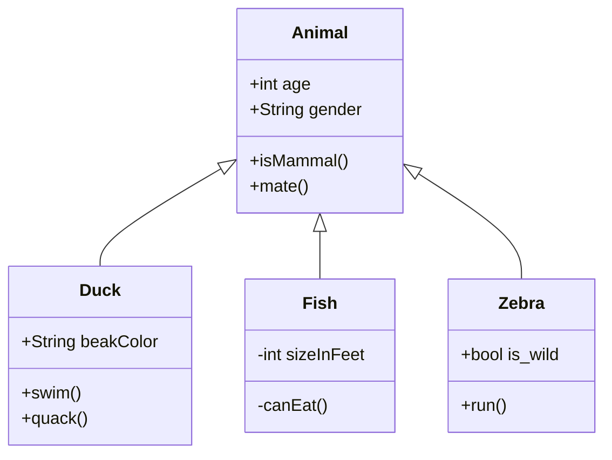

**Open 3D Engine （O3DE）** 网站包括对以下工具的支持，这些工具可以帮助满足某些 O3DE 文档的特殊格式需求。

## TeX 和 MathML 中的数学公式 {#math-formulas}

您可以使用 TeX 和 MathML 输入格式嵌入数学公式。有关如何使用 MathJax 版本 3.0 显示引擎的更多信息，请参阅 [MathJax 文档](https://docs.mathjax.org/en/latest/index.html) 。

**示例用法**

```markdown
$$\left( \sum_{k=1}^n a_k b_k \right)^2 \leq \left( \sum_{k=1}^n a_k^2 \right) \left( \sum_{k=1}^n b_k^2 \right)$$
```

**示例输出**

$$\left( \sum_{k=1}^n a_k b_k \right)^2 \leq \left( \sum_{k=1}^n a_k^2 \right) \left( \sum_{k=1}^n b_k^2 \right)$$

## 使用 Mermaid 的图表 {#diagrams}

您可以从 Markdown 代码块中创建各种图表和其他可视化效果，这些代码块将使用 Mermaid 图表工具进行呈现。请参阅 [Mermaid 文档](https://mermaid-js.github.io/mermaid/) 以了解各种支持的图表类型及其使用语法。

### 示例：流程图

````

````

**输出**


### 示例：UML 类图

````

````

**输出**


