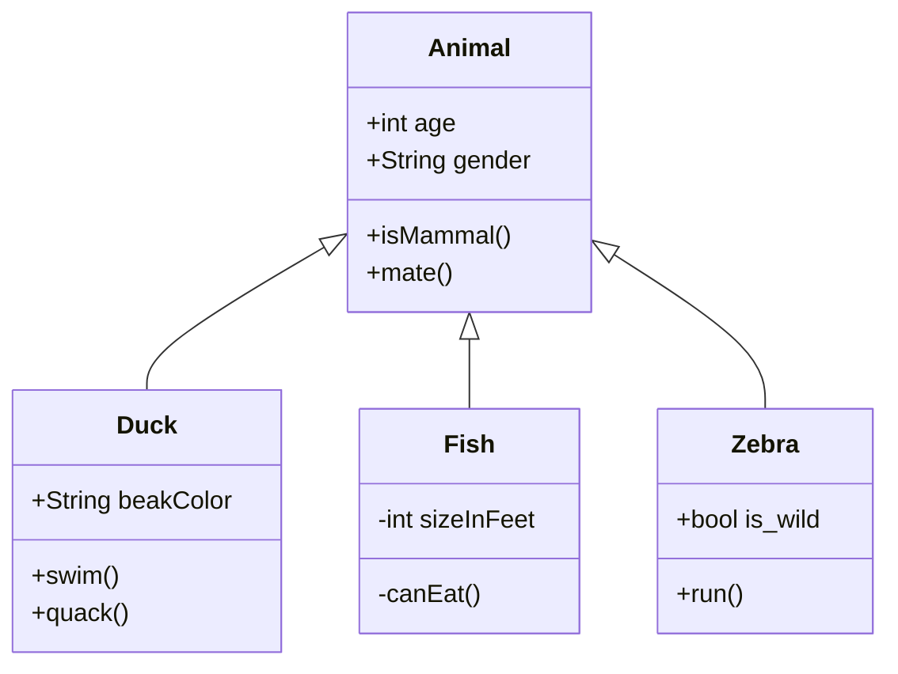

O3D 社区需要您的帮助，以记录和解释模块化、开源、三维仿真引擎（即**Open 3D Engine (O3DE)**）的内部工作和内部运作。在本专题中，您将了解到向本指南提供的资料应包括哪些内容、在目录结构中的位置，以及网站支持哪些工具来帮助您以最直观的方式展示您的内容。

## 贡献什么和贡献在哪里

O3DE 是一个复杂的软件产品，有许多工作部件。就像汽车有驾驶员使用指南和机械师维修手册一样，O3DE 也有用户使用指南和引擎开发指南。**引擎开发人员指南**是一个记录架构概念的地方，这些概念对于源代码注释来说太长或太宽泛，而且可能难以用语言表达。

以下 `engine-dev` 子目录中包含的特定内容可为本指南做出卓越贡献：

* `architecture` - 概念性内容和图表说明引擎的整体架构，解释设计决策和执行流程。
* `frameworks` - 深入探讨核心库（包括 `AzCore` 和 `AzFramework`）以及专业库（如 `AzNetworking`）的设计和使用。
* `gems` - 概念性内容和图表说明 Gem 的整体架构，解释设计决策和执行流程。
* `assets` - 开发人员了解资产系统的设计，包括开发人员在扩展或修改系统时可能需要了解的任何信息。
* `tools` - 概念性内容和图表说明特定工具的整体架构，解释设计决策和执行流程。

概念性主题通常得益于以下类型的覆盖面和视觉辅助工具：

* 架构概述和设计选择说明。
* 执行流程，使用流程图帮助可视化。
* 代码映射表和 UML 类图，用于记录 C++ 类。
* 调试技巧。
* 测试技巧和示例
* 脚本和其他命令行开发工具，以及使用技巧和示例。


[o3de.org](https://o3de.org)网站支持Mermaid图表工具，该工具使用Markdown代码块内的文本语法来呈现图表和可视化效果。要了解用美人鱼创建图表的更多信息，请参阅 [用Markdown 创建流程图和类图](#diagramming-tools)。


## 链接源代码

在 GitHub 上链接源代码时，尤其是链接文件中的代码块时，最好使用永久链接。文档是时间的快照，而指向特定提交的永久链接则为链接的源代码保留了这一概念。

#### 创建文件永久链接

要为 GitHub 仓库中的文件获取永久链接，请导航至**Code**选项卡并打开文件，然后从...菜单中选择**Copy permalink**：


要嵌入链接，请使用标准的 Markdown 链接格式。

**示例**

链接: `[SettingsInterface](https://github.com/o3de/o3de/blob/69dbcd08a56539315bfb0472984daf0f46e7a966/Code/Tools/ProjectManager/Source/SettingsInterface.h)`

输出: [SettingsInterface](https://github.com/o3de/o3de/blob/69dbcd08a56539315bfb0472984daf0f46e7a966/Code/Tools/ProjectManager/Source/SettingsInterface.h)

#### 创建代码行的永久链接

获取 GitHub 仓库文件中特定代码行的永久链接：

1. 导航至 **Code**选项卡并打开文件。
1. 单击代码块中的第一个行号。
1. Shift + 单击代码块中的最后一行编号。
1. 从第一行编号左侧的...菜单中选择 **Copy permalink**：


或者，您也可以使用格式手动将行号范围添加到文件的永久 URL 末尾：`#Lnnn-Lnnn`，其中 `nnn` 代表行号。

**示例**

链接: `[SettingsInterface::Get](https://github.com/o3de/o3de/blob/69dbcd08a56539315bfb0472984daf0f46e7a966/Code/Tools/ProjectManager/Source/SettingsInterface.h#L31-L44)`

输出: [SettingsInterface::Get](https://github.com/o3de/o3de/blob/69dbcd08a56539315bfb0472984daf0f46e7a966/Code/Tools/ProjectManager/Source/SettingsInterface.h#L31-L44)

#### 使用简单链接

如果您链接的是整个文件，并且有理由确定其文件名不会改变，那么使用一个更短、更简单的链接也是可以接受的。

**示例**

链接: `[EngineInfo.h](https://github.com/o3de/o3de/blob/development/Code/Tools/ProjectManager/Source/EngineInfo.h)`

输出: [EngineInfo.h](https://github.com/o3de/o3de/blob/development/Code/Tools/ProjectManager/Source/EngineInfo.h)

## 格式化工具

为了帮助您直观地理解概念，[o3de.org](https://o3de.org) 网站支持以下格式化工具。

### 用 Markdown 创建流程图和类图 {#diagramming-tools}

您可以在 Markdown 代码块中创建各种图表和其他可视化内容，并使用Mermaid图表工具进行渲染。请参阅 [Mermaid文档](https://mermaid-js.github.io/mermaid/) 了解各种受支持的图表类型及其使用语法。

#### 示例: Flowchart

````

````

**输出**


#### 示例: UML 类图

````

````

**输出**


### 数学公式

您可以使用 TeX 和 MathML 输入格式嵌入数学公式。有关如何使用 MathJax 3.0 版显示引擎的详细信息，请参阅 [MathJax 文档](https://docs.mathjax.org/en/latest/index.html)。

**示例用法**

```markdown
$$\left( \sum_{k=1}^n a_k b_k \right)^2 \leq \left( \sum_{k=1}^n a_k^2 \right) \left( \sum_{k=1}^n b_k^2 \right)$$
```

**示例输出**

$$\left( \sum_{k=1}^n a_k b_k \right)^2 \leq \left( \sum_{k=1}^n a_k^2 \right) \left( \sum_{k=1}^n b_k^2 \right)$$

## 关于贡献的一般信息

有关文档贡献的更多一般信息，包括详细的样式指南、更多格式化选项以及有关提交贡献过程的信息，请参阅 [贡献指南](/docs/contributing/to-docs/) 的 docs 部分。
