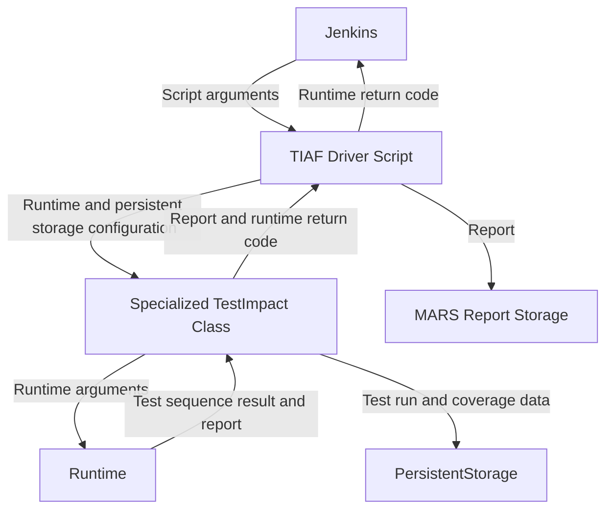

将 TIAF 本地运行时和 Python 运行时集成到 O3DE 的自动审查（AR）由一组 Python 脚本处理，这些脚本可在 [此处](https://github.com/o3de/o3de/tree/development/scripts/build/TestImpactAnalysis)找到。驱动程序脚本 “tiaf_driver.py ”由 Jenkins 使用[命令行选项](/docs/engine-dev/tools/tiaf/maintaining-tiaf/general-information#what-are-the-command-line-options-for-the-tiaf-ar-scripts)指定的参数调用。该脚本会调用相应的 “TestImpact ”类，而 “TestImpact ”类又会使用给定的参数调用相应的运行时可执行文件。要调试 TIAF AR 脚本，请参阅 [如何在本地重现 TIAF AR 运行？](/docs/engine-dev/tools/tiaf/maintaining-tiaf/debugging-tiaf#how-do-i-reproduce-a-tiaf-ar-run-locally)。

## AR 集成示意图

以下是 TIAF AR 脚本及其如何集成到 AR 中的简化示意图。如您所见，Jenkins 会调用 TIAF 驱动程序脚本并返回返回代码（`0`表示成功，否则为失败）。有关测试失败、启动测试目标失败以及任何其他失败的输出都会输出到控制台。有关运行时返回代码的更多信息，请参阅 [运行时返回代码](/docs/engine-dev/tools/tiaf/architectural-overview/runtime-frontend#runtime-return-codes) 一节。

