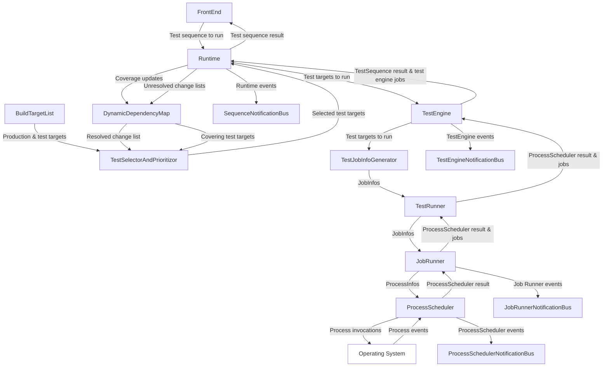
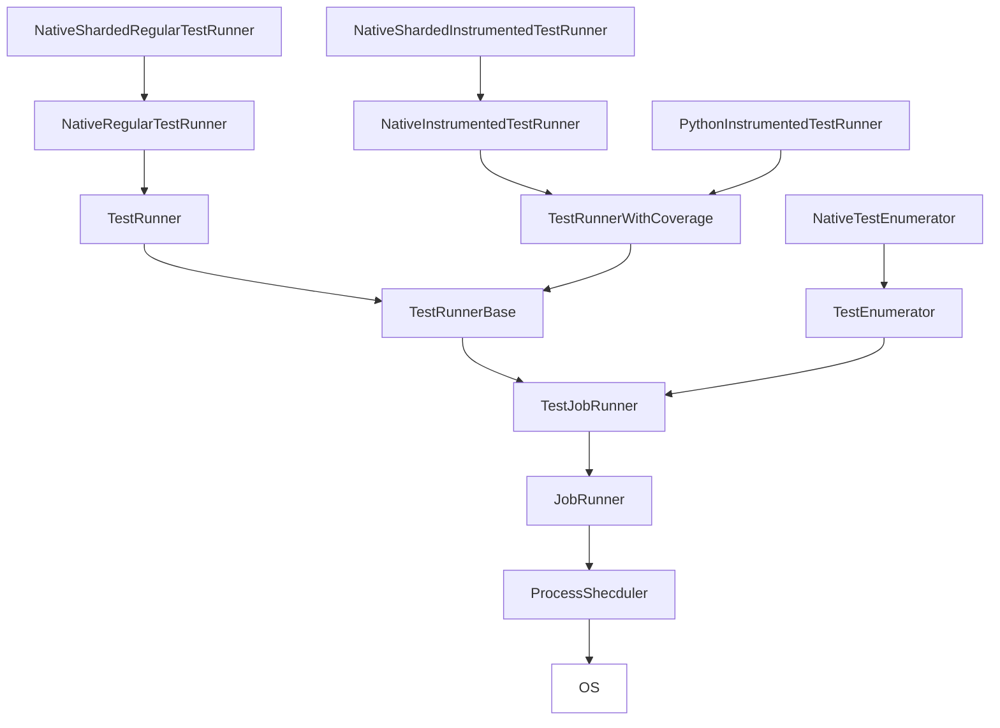
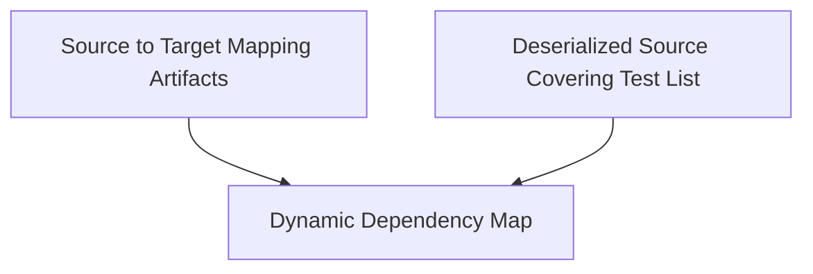

运行时和前端协同作业，为用户提供统一的界面，用于选择、优先处理和运行测试，然后向用户提供测试结果报告。运行时负责执行繁重的作业，而前端则将所需的操作传达给运行时，并将结果呈现给用户。

## 简化系统图

下面是运行时和前端子系统的简化示意图，以及它们之间的交互方式（为清晰起见，省略了本地和 Python 专用）：

## 工件

工件是运行时之间传递的 “普通旧数据结构”（POD）。这些工件有两种类型： **静态**工件和**动态**工件。这些工件是 POD，允许它们在运行时之间传递，而这些工件的生产者和消费者无需了解运行时本身是如何为这些工件的行为建模的。然后，这些工件将被用于实例化更复杂的类型，运行时将通过各种工件工厂直接使用这些类型。这些工件的位置可参见 [此处](https://github.com/o3de/o3de/tree/development/Code/Tools/TestImpactFramework/Runtime/Common/Code/Include/Static/Artifact)。

### 静态工件

静态工件由 TIAF CMake 脚本生成，用于在内存中建立 O3DE 的构建树模型。这些工件只在运行 CMake 时生成一次，并在调用运行时之间持续存在。这些工件包含每个构建目标及其源文件映射的信息，以及每个构建目标是否是生产目标（用于构建 O3DE 产品本身的构建目标）和测试目标（包含要为其覆盖的生产目标运行的测试的构建目标）的信息。

### 动态工件

动态工件是运行时为每次调用生成的工件，在两次调用之间可能持续，也可能不持续。这类工件对测试运行的测试结果和覆盖范围进行建模，与测试目标的语言和框架特定测试结果和覆盖范围输出有着近乎一一对应的映射关系。

### 工件工厂

工件工厂获取这些原始 POD 工件，并生成运行时内部使用的类型。特别是测试目标描述符工厂，由于无法在 CMake 层面获取构建树的信息，因此每个实例化类型需要消耗多个工件。

## 测试运行堆栈

下图展示了测试运行堆栈。由于该图是类图和全向数据流图的组合，因此最好不要过于照本宣科。相反，您可以把它作为给定测试运行程序的起点，看看您需要如何深入代码，才能找到组成该测试运行程序的各个类。

下面简要介绍堆栈的各个部分（按自下而上的顺序）及其在堆栈中的功能。

### ProcessScheduler

`ProcessScheduler` 负责进程的启动和生命周期管理。调用调度程序来调度进程是阻塞的，尽管客户端可以选择提供回调来监听进程状态的变化。调度器没有构建目标、测试目标、测试等高层构造的概念，因为它只负责管理进程，不管这些进程是什么。虽然它在内部管理进程的状态（待启动、飞行中、已完成等），但从客户端的角度来看，它是无状态的，因此不会向客户端展示跟踪的状态。相反，它为每个进程的生命周期事件提供了大量回调，客户端可以挂钩这些回调并根据需要进行跟踪。

#### 输入

`ProcessScheduler`接受以`ProcessInfos`形式列出的要启动的进程列表，以及在任何给定时间内应同时有多少个进程在运行，同时还接受可选的超时限制，以限制进程在运行中的时间，并接受可选的回调，以便客户端监听进程状态的变化。每个 `ProcessInfo` 都包含一个由客户机提供的唯一标识符，这样客户机就能确定在 `ProcessScheduler` 的回调中引用的是哪个进程，以及该进程产生的标准输出/错误应如何路由的详细信息。进程的调用由操作系统执行的命令字符串指定。

#### 过程

`ProcessScheduler`负责管理请求启动的进程的整个生命周期，包括与操作系统的所有通信，以便（根据需要）调用、跟踪和终止进程。当每个进程的状态发生变化时，会调用相应的回调（如果客户机提供了回调），如果进程被指示将标准输出/错误路由到客户机，则最后的生命周期结束回调会包含任何累积的标准输出/错误。客户端会向`ProcessScheduler`返回一个值，以确定是继续运行还是关闭。

#### 输出

`ProcessSchedulerResult`会返回一个`ProcessSchedulerResult`，供客户端确定调度器在什么情况下终止。所有其他状态都必须由客户端通过回调来跟踪。

#### 常见问题

##### 如果ProcessScheduler处于阻塞状态，是否会锁定其运行的线程？

`ProcessScheduler`会在进程状态发生变化时将控制权交还给客户端，并提供一个 tick 回调（频率由客户端决定），使客户端不会在进程状态变化之间停滞。我们还为客户端提供了一个接口，用于向`ProcessScheduler`发送终止特定进程的消息，以及向`ProcessScheduler`返回一个值，以确定是继续运行还是关闭。

#### 我希望支持另一个平台，ProcessScheduler 是特定于平台的吗？

为了支持新的平台，您需要覆盖 `Process` 类，并实现纯虚拟方法来启动、终止和查询特定平台进程的状态。

### JobRunner

`JobRunner` 为`ProcessScheduler`提供了一个简化的有状态接口。与 `ProcessScheduler` 一样，它也为客户端提供了可选的回调，以捕获进程产生的实时标准输出/错误，但它只在成功/不成功的进程生命周期结束事件时提供了一个生命周期事件回调。重要的是，`JobRunner`的运行前提是每个进程都在执行作业，而作业的结果就是作业产生的有效负载。这些有效载荷是以附加数据结构的形式指定的，其中包含有关该有效载荷的元数据。测试运行程序利用这些数据，产生的有效载荷就是测试框架和覆盖工具写入磁盘的文件形式的测试和覆盖工件。

#### 输入

`JobRunner`接受一组`JobInfos`列表，其中指定了每个作业的命令字符串、有效载荷元数据和唯一标识符，以及每个作业的作业完成回调和可选超时限制。此外，客户端还提供了一个`PayloadMapProducer`函数，所有任务完成后，每个成功完成的任务都会调用该函数。该`PayloadMapProducer`函数允许客户端获取每个作业的有效载荷元数据，并消耗由此产生的有效载荷工件。对于测试运行程序来说，这些 `PayloadMapProducers` 是测试框架和覆盖工具所必需的反序列化函数，用于消费每个作业产生的各自的有效载荷工件。


将由 `JobRunner` 运行的`JobInfos` 是由测试运行程序堆栈中较高的给定运行程序的`JobInfoGenerator`生成的。为清晰起见，上图中省略了这些生成器。


#### 过程

`JobRunner`挂钩到`ProcessScheduler`，并跟踪每个进程的状态，然后向客户端提交每个作业的摘要。该摘要包含开始时间、持续时间、作业结果、返回代码等信息，以便测试运行程序能解释给定测试运行的结果。所有作业完成后，`JobRunner`会为每个作业调用客户提供的`PayloadMapProducer`，以生成每个作业产生的作业的内存模型。

#### 输出

`JobRunner`会返回一个 `ProcessSchedulerResult`（进程调度器结果），供客户端确定调度器在什么情况下终止，以及每个调用进程产生的作业。这些作业包含作业的元数据（持续时间、返回代码等）以及每个作业产生的内存有效载荷数据结构。

#### 常见问题

##### 是否假设作业会产生文件？

不是。由于作业产生的有效负载信息是由客户端提供的，因此应由您来决定这些有效负载是什么以及如何使用它们。

##### 我能否使用内存中的内容（例如标准输出/错误）？

可以，见上文。由于您可以将进程输出路由到客户端，因此您可以自行决定如何关联输出并使用它。

##### 作业产生的文件工件不一定与作业直接相关，是否可以被消耗？

是的，事实上 Python 工具测试运行器就能做到这一点。您需要做的就是实现一个适当的 `PayloadMapProducer` 来处理这个问题，因为 `PayloadMapProducer` 是与所有已完成的作业一起提供的，所以您可以自行决定如何生成适当的有效负载映射。

##### JobInfos 包含 id 和命令字符串，但 JobInfos 本身是模板特化，因此所述 id 和命令字符串在不同 JobInfo 类型之间不能互换。这是故意的吗？

是的。虽然在引擎盖下，`ProcessScheduler` 可以理解相同的 id 和命令字符串，但 JobInfos 既不能互换，也不能在不同专业化之间转换，这样做是为了确保给定的作业 id 或命令字符串只对该作业类型有效，而不会意外地与其他作业类型混淆（例如，如果试图将相同的作业回调用于不同的作业类型）。

### TestJobRunner

`TestJobRunner` 是`TestEnumerator`和 `TestRunnerBase`的中间基类，可与其拥有的`JobRunner` 交互。它不包含公共接口，只在这些高层类之间共享状态。因此，该类没有输入、处理或输出。

### TestEnumerator

`TestEnumerator`是从 `TestJobRunner`类模板派生出来的基类，并针对支持从命令行枚举测试的测试框架进行了部分专门化。一旦枚举了测试，其结果可选择缓存在磁盘上，并在以后的枚举中重新读取，而不是从命令行调用测试框架的枚举。枚举出的测试将存储在内存中的`TestEnumeration`数据结构中，其中包含固定装置和属于这些固定装置的测试，以及测试框架中是否启用或禁用这些测试/固定装置的信息。

#### 输入

The `TestEnumerator` 接受的输入与 `JobRunner`.

#### 过程

`TestEnumerator` 围绕`JobRunner`调用运行作业，并注入其 `PayloadMapProducer`和`PayloadExtractor`。作为选项，它可以尝试从缓存文件（由客户端指定）中读取枚举和/或在枚举完成后将枚举存储在所述缓存中。

#### 输出

`TestEnumerator` 返回与`JobRunner`相同的输出。

#### 常见问题

##### 您似乎在整个测试和枚举数据结构中使用了术语 `TestSuite`，而不是`TestFixture`。这是为什么？

这是早期开发时的一个令人遗憾的疏忽，当时的术语借用了 GTest 的命名约定。由于我们也有实际测试套件的概念，而当前的名称冲突可能会导致混淆，因此在未来的 PR 中，这些将被重新命名为 `TestFixture`。

##### 我的测试框架不支持测试枚举。我还能实现测试枚举器吗？

可以，但成功率各有不同。一种方法是将测试运行序列化为测试枚举，并将其存储在缓存中，只在缓存中使用枚举器。这并不理想，但还是可行的。当然，这也意味着你不能在过去运行测试之前枚举它们，所以如果你的测试不稳定（即测试经常被添加/删除），那么你可能会遇到缓存中的枚举已经过时的情况。不过，使用动态依赖关系映射（Dynamic Dependency Map）很容易确定缓存是否过时（参见：动态依赖关系映射）。

### NativeTestEnumerator

`NativeTestEnumerator`派生自 `TestEnumerator`，并实现了 `PayloadExtractor`方法，以提取使用 GTest 框架的 C++ 测试生成的枚举工件。

#### 输入

`NativeTestEnumerator`接受与`TestEnumerator`相同的输入。

#### 过程

`NativeTestEnumerator` 从 GTest XML 文件枚举工件中提取枚举有效载荷。

#### 输出

`NativeTestEnumerator`返回与`TestEnumerator`相同的输出。

#### 常见问题

##### NativeTestEnumerator 的用途是什么？

`NativeTestEnumerator` 生成的测试枚举被本地分片测试运行器用于将测试目标分解为子测试并并行运行，从而优化本地测试运行时间。

##### 为什么没有 PythonTestEnumerator？

在撰写本文时，由于编辑器不完全支持并行运行 Python 测试，因此无法任意并行运行 Python 测试。如果将来这一缺陷得到解决，我们将实现`PythonTestEnumerator`。

### TestRunnerBase

`TestRunnerBase`是测试运行堆栈的第一层，它具有运行测试的概念。它是一个抽象类，围绕着 `TestJobRunner`，为运行测试提供一个接口，并为测试运行器提供虚拟和纯虚拟方法，以实现 `PayloadMapProducer`，从完成的作业中提取各自的有效载荷。在堆栈的更高层，`TestRunner`和`TestRunnerWithCoverage`将该类特殊化，以实现它们的常规和工具化测试运行行为。

#### 输入

`TestRunnerBase`接受与`JobRunner`相同的输入。

#### 过程

`TestRunnerBase`封装了 `JobRunner`运行作业的调用，并注入了`PayloadMapProducer`和`PayloadExtractor`，后者由派生类实现。

#### 输出

`TestRunnerBase`返回与`JobRunner`相同的输出。

#### 常见问题

##### TestRunnerBase 是否针对特定平台/语言/测试框架/覆盖工具？

两者都不是。虽然它有一个模糊的测试概念，但它仍然使用命令字符串来调用作业，并将所有有效负载消耗委托给客户端。它不知道什么是语言、测试框架或覆盖工具，它只知道可以从命令行调用测试，客户端可以使用该测试的有效载荷。

##### 我希望支持一种新的语言/测试框架/覆盖工具。这可能吗？

可以，目前的堆栈支持 C++ 和 Python 测试，这两种语言使用不同的测试框架和覆盖工具。如果您的测试可以从命令行字符串中调用，并且可以生成测试结果和/或覆盖率数据，在测试完成后可以使用这些数据，那么您的语言/测试框架/覆盖率工具就可以得到支持。

### TestRunner

`TestRunner`派生于`TestRunnerBase` 类模板，该模板为 `TestRunnerBase` 提供了`TestRun`模板参数。该类不提供其他功能，只是作为本地测试运行器和 Python 测试运行器的部分模板特化。

#### 输入

`TestRunner`接受的输入与 `TestRunnerBase`相同。

#### 过程

`TestRunner`不进行任何特定处理。

#### 输出

`TestRunner`返回与`TestRunnerBase`相同的输出。

### NativeRegularTestRunner

`NativeRegularTestRunner`派生自`TestRunner`，并实现`PayloadExtractor`处理 GTest 测试运行工件的提取。

#### 输入

`NativeRegularTestRunner` 接受的输入与 `TestRunner`相同。

#### 过程

`NativeRegularTestRunner` 从 GTest XML 文件中提取测试运行有效载荷。

#### 输出

`NativeRegularTestRunner`返回与`TestRunner`相同的输出。

#### 常见问题

##### 为什么没有像本地测试运行程序那样的`PythonRegularTestRunner`？

与本地测试运行程序不同，常规测试运行程序和工具测试运行程序之间没有区别，因为 Python 测试总是在启用了 `PythonCoverage` gem 的情况下运行的。因此，我们假定所有 Python 测试都是工具测试，因此不需要对应的常规测试运行器。

### TestRunnerWithCoverage

`TestRunnerWithCoverage`是从`TestRunnerBase`类模板派生出来的，它提供了 `TestRun`和`CoverageArtifact`模板参数，作为`TestRunnerBase`的一对。该类不提供其他功能，而是作为本地测试运行器和 Python 工具测试运行器的部分模板特化。

#### 输入

`TestRunnerWithCoverage`接受的输入与`TestRunnerBase`相同。

#### 过程

`TestRunnerWithCoverage`不进行任何特定处理。

#### 输出

`TestRunnerWithCoverage`返回与`TestRunnerBase`相同的输出。

### PythonInstrumentedTestRunner

`PythonInstrumentedTestRunner`派生于`TestRunnerWithCoverage`，并实现了`PayloadExtractor`，以处理从`AutomatedTesting`项目中的 `PythonCoverage` gem 提取 PyTest 测试运行工件和 PyCoverage 工件的过程。

#### 输入

`PythonInstrumentedTestRunner` 接受的输入与 `TestRunnerWithCoverage`相同。

#### 过程

`PythonInstrumentedTestRunner`会从 PyTest XML 文件测试运行工件中提取测试运行有效载荷。对于 `ModuleCoverage` 工件，每个测试夹具都有一个专用文件夹，通过从给定的`JobInfo`中调用`GetCoverageArtifactPath` 可获得该文件夹，然后扫描该文件夹以查找所有`.pycoverage`文件，这些文件又会被提取到 `PythonModuleCoverage` 工件中。

#### 输出

`PythonInstrumentedTestRunner`返回与`TestRunnerWithCoverage`相同的输出。

### NativeInstrumentedTestRunner

`NativeInstrumentedTestRunner`派生于 `TestRunnerWithCoverage`，并实现了 `PayloadExtractor`，以处理 GTest 测试运行工件和 JUnit 覆盖工件的提取。

#### 输入

`NativeInstrumentedTestRunner` 接受的输入与 `TestRunnerWithCoverage`.

#### 过程

`NativeInstrumentedTestRunner` 从 GTest XML 文件中提取测试运行有效载荷，并从 OpenCppCoverage 生成的 JUnit 覆盖工件中提取覆盖有效载荷。

#### 输出

`NativeInstrumentedTestRunner`返回与`TestRunnerWithCoverage`相同的输出。

### 本地分片测试运行器

`NativeShardedRegularTestRunner`和`NativeShardedInstrumentedTestRunner`是一种优化工具，可将已选择的测试目标分割成碎片，并将其分配给可用的硬件内核，以提高性能。它们通过提供与标准测试运行程序类似的接口，以透明的方式实现这一目标。它们将分片测试目标的 `JobInfos`反馈给标准的 `NativeRegularTestRunner` 和 `NativeInstrumentedTestRunner`测试运行程序（每个测试目标可能有多个 `JobInfos` ），然后再将标准测试运行程序的输出合并为每个测试目标的一个`Job`。这两个分片测试运行器都源于 `NativeShardedTestRunnerBase`（上图中未显示），并实现了 `ConsolidateSubJobs` 功能。

#### 输入

本地分片测试运行器接受`ShardedTestJobInfos`作为其输入，其中每个 `ShardedTestJobInfo` 都包含有关呈现给用户的父作业和分片子作业的信息，这些信息将被提供给标准测试运行器。

#### 过程

本地分片测试运行程序会等到给定父作业的分片子作业完成后，才会向用户发出相应的通知。所有分片子任务完成后，本地分片测试运行程序会将分片子任务整合回父任务中，并向用户展示这些父任务，就像分片从未发生过一样。

#### 输出

本地分片测试运行器返回的输出结果与 `NativeRegularTestRunner` 和 `NativeInstrumentedTestRunner` 相同。

#### 常见问题

##### 为什么没有像本地分片测试运行器那样的 Python 分片测试运行器？

由于 Python 测试不能在测试级别上任意并行执行，因此没有必要使用分片 Python 测试运行器。

## 动态依赖关系映射

动态依赖关系映射（DDM）包含所有源文件与其父构建目标和覆盖测试目标的映射，分两个阶段构建：

1. 源到目标映射文件会被解析，源会被插入到 DDM 中，并映射到它们的父构建目标。
2. 如果存在序列化的源代码覆盖测试列表，则对其进行解析，并将列表中所有源文件的测试覆盖范围适当映射到 DDM 中。

值得注意的是，用于构建 DDM 的上述两个数据源是相互独立的。源到目标映射工件是构建系统生成步骤的副产品，而源覆盖测试列表则是上一次 TIAF 运行的测试覆盖快照。因此，在构建 DDM 和应用源更改的 CRUD 规则时，必须确保两个数据源的完整性。

### DDM 诚信： 永远做最坏的打算

由于测试影响分析的可信度取决于测试影响数据的完整性，因此我们对 “源到目标映射 ”数据和 “源覆盖测试列表 ”数据之间的任何差异持悲观态度，认为 DDM 已损坏，因此从当前数据集继续进行不安全。因此，在下面的 CRUD 规则表中，只有一部分可能的排列组合会导致有效的操作，其余的排列组合会中止流程，而不会尝试确定 DDM 的完整性受到损害的原因。在这种情况下，需要对测试影响分析数据进行全面重新搜索，以便测试影响分析能够从头开始。

### 源文件 CRUD 规则

以下是本地和 Python `TestSelectorAndPrioritizor `针对源文件 CRUD 更改而执行的操作。下面列出的是 CRUD 操作和源到目标映射工件和/或源依赖关系列表中的条目可能出现的每种排列方式。

#### 本地 CRUD 规则

以下是本地运行时使用的 `TestSelectorAndPrioritizor` 的 CRUD 规则 rubrik。这些规则的实现可参见 [此处](https://github.com/o3de/o3de/blob/development/Code/Tools/TestImpactFramework/Runtime/Common/Code/Include/Static/Dependency/TestImpactTestSelectorAndPrioritizer.h)。

|        | 父级目标 | 覆盖数据 | 源类型 | 场景                                     | 动作                                  |
|--------|------|------|-----|----------------------------------------|-------------------------------------|
| Create | 是    | 否    | 产品  | 1. 文件已新建。                              | 1. 选择覆盖父生产目标的所有测试目标。                |
|        |      |      |     | 2. 该文件存在于一个或多个源到生产目标的映射工件中。            |                                     |
|        |      |      |     | 3. 源覆盖测试列表中没有该文件的覆盖数据。                 |                                     |
|        |      |      | 测试  | 1. 文件已新建。                              | 1. 选择所有父测试目标。                       |
|        |      |      |     | 2. 该文件存在于一个或多个源到测试目标的映射工件中。            |                                     |
|        |      |      |     | 3. 源覆盖测试列表中没有该文件的覆盖数据。                 |                                     |
|        | 否    | 是    | 未确定 | 1. 该文件以前存在于一个或多个源到目标的映射工件中。            | 1. 日志 **源覆盖测试列表完整性受到影响**错误。         |
|        |      |      |     | 2. 该文件已被删除，但没有执行删除垃圾的操作：               | 2. 抛出异常。                            |
|        |      |      |     | 1. 该文件的覆盖数据未从源覆盖测试列表中删除。               |                                     |
|        |      |      |     | 3. 此后，该文件被重新创建。                        |                                     |
|        |      |      |     | 4. 该文件不存在于任何源到目标的映射工件中。                |                                     |
|        | 否    | 否    | 未确定 | 1. 文件已新建。                              | 1. 跳过文件。                            |
|        |      |      |     | 2. 该文件不存在于任何源到目标的映射工件中。                |                                     |
|        | 是    | 是    | 不相关 | 1. 该文件以前存在于一个或多个源到目标的映射工件中。            | 1. 日志 **源覆盖测试列表已损坏** 错误。            |
|        |      |      |     | 2. 该文件已被删除，但没有执行删除垃圾的操作：               |                                     |
|        |      |      |     | 1. 该文件的覆盖数据未从源覆盖测试列表中删除。               | 2. 抛出异常。                            |
|        |      |      |     | 3. 此后，该文件被重新创建。                        |                                     |
|        |      |      |     | 4. 该文件存在于一个或多个源到目标的映射工件中。              |                                     |
| Update | 是    | 否    | 产品  | 1. 现有文件已被修改。                           | 1. 跳过文件。                            |
|        |      |      |     | 2. 该文件存在于一个或多个源到生产目标的映射工件中。            |                                     |
|        |      |      |     | 3. 源覆盖测试列表中没有该文件的覆盖数据。                 |                                     |
|        |      |      | 测试  | 1. 现有文件已被修改。                           | 1. 选择该文件的所有父测试目标。                   |
|        |      |      |     | 2. 该文件存在于一个或多个源到测试目标的映射工件中。            |                                     |
|        |      |      |     | 3. 源覆盖测试列表中没有该文件的覆盖数据。                 |                                     |
|        | 否    | 是    | 未确定 | 1. 现有文件已被修改。                           | 1. 记录**潜在的孤儿源文件**警告。                |
|        |      |      |     | 2. 或者:                                 |                                     |
|        |      |      |     | 1. 该文件以前存在于一个或多个源到目标的映射工件中。            | 2. 选择覆盖该文件的所有测试目标。                  |
|        |      |      |     | 2. 该文件已不存在于任何源到目标的映射工件中。               | 3. 从源覆盖测试列表中删除现有覆盖数据。               |
|        |      |      |     | 3. 该文件的覆盖数据尚未从源覆盖测试列表中删除。              |                                     |
|        |      |      |     | 3. 或者:                                 |                                     |
|        |      |      |     | 1. 编译目标正在使用该文件，但却错误地没有明确添加（如头文件包含）。    |                                     |
|        | 否    | 否    | 未确定 | 1. 现有文件已被修改。                           | 1. 跳过文件。                            |
|        |      |      |     | 2. 该文件不存在于任何源到目标的映射工件中。                |                                     |
|        |      |      |     | 3. 源覆盖测试列表中没有该文件的覆盖数据。                 |                                     |
|        | 是    | 是    | 产品  | 1. 现有文件已被修改。                           | 1. 选择覆盖该文件的所有测试目标。                  |
|        |      |      |     | 2. 该文件存在于一个或多个源到生产目标的映射工件中。            |                                     |
|        |      |      |     | 3. 源覆盖测试列表中存在该文件的覆盖数据。                 |                                     |
|        |      |      | 测试  | 1. 现有文件已被修改。                           | 1. 为该文件选择父测试目标。                     |
|        |      |      |     | 2. 该文件存在于一个或多个源到测试目标的映射工件中。            |                                     |
|        |      |      |     | 3. 源覆盖测试列表中存在该文件的覆盖数据。                 |                                     |
| Delete | 是    | 否    | 不相关 | 1. 文件已删除。                              | 1. 日志 **源到目标映射完整性受损**错误。            |
|        |      |      |     | 2. 该文件仍然存在于一个或多个源到目标的映射工件中。            | 2. 抛出异常。                            |
|        |      |      |     | 3. 源覆盖测试列表中没有该文件的覆盖数据。                 |                                     |
|        | 否    | 是    | 未确定 | 1. 文件已删除。                              | 1. 选择覆盖该文件的所有测试目标。                  |
|        |      |      |     | 2. 该文件以前存在于一个或多个源到目标的映射工件中。            | 2. 从源覆盖测试列表中删除现有覆盖数据。               |
|        |      |      |     | 3. 该文件已不存在于任何源到目标的映射工件中。               |                                     |
|        |      |      |     | 4. 该文件的覆盖数据尚未从源覆盖测试列表中删除。              |                                     |
|        | 否    | 否    | 未确定 | 1. 文件已删除。                              | 1. 跳过文件。                            |
|        |      |      |     | 2. 该文件不存在于任何源到目标的映射工件中。                |                                     |
|        |      |      |     | 3. 源覆盖测试列表中没有该文件的覆盖数据。                 |                                     |
|        | 是    | 是    | 不相关 | 1. The existing file has been deleted. | 1. 记录**源到目标映射**和**源覆盖测试列表完整性受损**错误。 |
|        |      |      |     | 2. 该文件仍然存在于一个或多个源到目标的映射工件中。            | 2. 抛出异常。                            |
|        |      |      |     | 3. 源覆盖测试列表中存在该文件的覆盖数据。                 |                                     |

### Python CRUD 规则

以下是本地运行时使用的`PythonTestSelectorAndPrioritizor`的 CRUD 规则 rubrik。这些规则的实现可参见 [此处](https://github.com/o3de/o3de/blob/development/Code/Tools/TestImpactFramework/Runtime/Python/Code/Source/Dependency/TestImpactPythonTestSelectorAndPrioritizer.h)。

|        | Parent Target(s)? | Source Coverage Data? | Parent Coverage Data? | Source Type   | Scenario                            | Action                                  |
|--------|-------------------|-----------------------|-----------------------|---------------|-------------------------------------|-----------------------------------------|
| Create | Yes               | No                    | All                   | Production    | 1. 文件已新建。                           | 1. 选择覆盖父生产目标的所有测试目标。                    |
|        |                   |                       |                       |               | 2. 该文件存在于一个或多个源到生产目标的映射工件中。         |                                         |
|        |                   |                       |                       |               | 3. 源覆盖测试列表中没有该文件的覆盖数据。              |                                         |
|        |                   |                       |                       |               | 4. 所有父目标在源覆盖测试列表中都有覆盖数据。            |                                         |
|        |                   |                       |                       | Test          | 1. 文件已新建。                           | 1. 选择该文件的所有父测试目标。                       |
|        |                   |                       |                       |               | 2. 该文件存在于一个或多个源到测试目标的映射工件中。         |                                         |
|        |                   |                       |                       |               | 3. 源覆盖测试列表中没有该文件的覆盖数据。              |                                         |
|        |                   |                       |                       |               | 4. 所有父测试目标在源覆盖测试列表中都有覆盖数据。          |                                         |
|        |                   |                       | Mixed to None         | Production    | 1. 文件已新建。                           | 1. 选择所有测试目标。                            |
|        |                   |                       |                       |               | 2. 该文件存在于一个或多个源到生产目标的映射工件中。         |                                         |
|        |                   |                       |                       |               | 3. 源覆盖测试列表中没有该文件的覆盖数据。              |                                         |
|        |                   |                       |                       |               | 4. 一个或多个父目标在源覆盖测试列表中没有覆盖数据。         |                                         |
|        |                   |                       |                       | Test          | 1. 文件已新建。                           | 1. 选择该文件的所有父测试目标。                       |
|        |                   |                       |                       |               | 2. 该文件存在于一个或多个源到测试目标的映射工件中。         |                                         |
|        |                   |                       |                       |               | 3. 源覆盖测试列表中没有该文件的覆盖数据。              |                                         |
|        |                   |                       |                       |               | 4. 一个或多个父测试目标在源覆盖测试列表中没有覆盖数据。       |                                         |
|        | No                | Yes                   | N/A                   | Indeterminate | 1. 该文件以前存在于一个或多个源到目标的映射工件中。         | 1. 日志 **源覆盖测试列表完整性受损** 错误。              |
|        |                   |                       |                       |               | 2. 该文件已被删除，但没有执行删除垃圾的操作：            | 2. 抛出异常。                                |
|        |                   |                       |                       |               | 1. 该文件的覆盖数据未从源覆盖测试列表中删除。            |                                         |
|        |                   |                       |                       |               | 3. 此后，该文件被重新创建。                     |                                         |
|        |                   |                       |                       |               | 4. 该文件不存在于任何源到目标的映射工件中。             |                                         |
|        | No                | No                    | N/A                   | Indeterminate | 1. 文件已新建。                           | 1. Skip the file.                       |
|        |                   |                       |                       |               | 2. 该文件不存在于任何源到目标的映射工件中。             |                                         |
|        | Yes               | Yes                   | Irrelevant            | Irrelevant    | 1. 该文件以前存在于一个或多个源到目标的映射工件中。         | 1. 日志 **源覆盖测试列表完整性受损** 错误。              |
|        |                   |                       |                       |               | 2. 该文件已被删除，但没有执行删除垃圾的操作：            | 2. 抛出异常。                                |
|        |                   |                       |                       |               | 1. 该文件的覆盖数据未从源覆盖测试列表中删除。            |                                         |
|        |                   |                       |                       |               | 3. 此后，该文件被重新创建。                     |                                         |
|        |                   |                       |                       |               | 4. 该文件存在于一个或多个源到目标的映射工件中。           |                                         |
| Update | Yes               | No                    | All                   | Production    | 1. 现有文件已被修改。                        | 1. 选择覆盖父生产目标的所有测试目标。                    |
|        |                   |                       |                       |               | 2. 该文件存在于一个或多个源到生产目标的映射工件中。         |                                         |
|        |                   |                       |                       |               | 3. 源覆盖测试列表中没有该文件的覆盖数据。              |                                         |
|        |                   |                       |                       |               | 4. 所有父目标在源覆盖测试列表中都有覆盖数据。            |                                         |
|        |                   |                       |                       | Test          | 1. 现有文件已被修改。                        | 1. 选择该文件的所有父测试目标。                       |
|        |                   |                       |                       |               | 2. 该文件存在于一个或多个源到测试目标的映射工件中。         |                                         |
|        |                   |                       |                       |               | 3. 源覆盖测试列表中没有该文件的覆盖数据。              |                                         |
|        |                   |                       |                       |               | 4. 所有父测试目标在源覆盖测试列表中都有覆盖数据。          |                                         |
|        |                   |                       | Mixed to None         | Production    | 1. 现有文件已被修改。                        | 1. 选择所有测试目标。                            |
|        |                   |                       |                       |               | 2. 该文件存在于一个或多个源到生产目标的映射工件中。         |                                         |
|        |                   |                       |                       |               | 3. 源覆盖测试列表中没有该文件的覆盖数据。              |                                         |
|        |                   |                       |                       |               | 4. 一个或多个父目标在源覆盖测试列表中没有覆盖数据。         |                                         |
|        |                   |                       |                       | Test          | 1. 现有文件已被修改。                        | 1. 选择该文件的所有父测试目标。                       |
|        |                   |                       |                       |               | 2. 该文件存在于一个或多个源到测试目标的映射工件中。         |                                         |
|        |                   |                       |                       |               | 3. 源覆盖测试列表中没有该文件的覆盖数据。              |                                         |
|        |                   |                       |                       |               | 4. 一个或多个父测试目标在源覆盖测试列表中没有覆盖数据。       |                                         |
|        | No                | Yes                   | N/A                   | Indeterminate | 1. 现有文件已被修改。                        | 1. 记录 **潜在的孤儿源文件** 警告。                  |
|        |                   |                       |                       |               | 2. 或者:                              |                                         |
|        |                   |                       |                       |               | 1. 该文件以前存在于一个或多个源到目标的映射工件中。         | 2. 选择覆盖该文件的所有测试目标。                      |
|        |                   |                       |                       |               | 2. 该文件已不存在于任何源到目标的映射工件中。            | 3. 从源覆盖测试列表中删除现有覆盖数据。                   |
|        |                   |                       |                       |               | 3. 该文件的覆盖数据尚未从源覆盖测试列表中删除。           |                                         |
|        |                   |                       |                       |               | 3. 或者:                              |                                         |
|        |                   |                       |                       |               | 1. 编译目标正在使用该文件，但却错误地没有明确添加（如头文件包含）。 |                                         |
|        | No                | No                    | N/A                   | Indeterminate | 1. 现有文件已被修改。                        | 1. 跳过文件。                                |
|        |                   |                       |                       |               | 2. 该文件不存在于任何源到目标的映射工件中。             |                                         |
|        |                   |                       |                       |               | 3. 源覆盖测试列表中没有该文件的覆盖数据。              |                                         |
|        | Yes               | Yes                   | Yes                   | Production    | 1. 现有文件已被修改。                        | 1. 选择覆盖该文件的所有测试目标。                      |
|        |                   |                       |                       |               | 2. 该文件存在于一个或多个源到生产目标的映射工件中。         |                                         |
|        |                   |                       |                       |               | 3. 源覆盖测试列表中存在该文件的覆盖数据。              |                                         |
|        |                   |                       |                       |               | 4. 所有父目标在源覆盖测试列表中都有覆盖数据。            |                                         |
|        |                   |                       |                       | Test          | 1. 现有文件已被修改。                        | 1. 为该文件选择父测试目标。                         |
|        |                   |                       |                       |               | 2. 该文件存在于一个或多个源到测试目标的映射工件中。         |                                         |
|        |                   |                       |                       |               | 3. 源覆盖测试列表中存在该文件的覆盖数据。              |                                         |
|        |                   |                       |                       |               | 4. 所有父测试目标在源覆盖测试列表中都有覆盖数据。          |                                         |
|        |                   |                       | Mixed to None         | Production    | 1. 现有文件已被修改。                        | 1. 选择所有测试目标。                            |
|        |                   |                       |                       |               | 2. 该文件存在于一个或多个源到生产目标的映射工件中。         |                                         |
|        |                   |                       |                       |               | 3. 源覆盖测试列表中存在该文件的覆盖数据。              |                                         |
|        |                   |                       |                       |               | 4. 一个或多个父目标在源覆盖测试列表中没有覆盖数据。         |                                         |
|        |                   |                       |                       | Test          | 1. 现有文件已被修改。                        | 1. 选择该文件的所有父测试目标。                       |
|        |                   |                       |                       |               | 2. 该文件存在于一个或多个源到生产目标的映射工件中。         |                                         |
|        |                   |                       |                       |               | 3. 源覆盖测试列表中存在该文件的覆盖数据。              |                                         |
|        |                   |                       |                       |               | 4. 一个或多个父测试目标在源覆盖测试列表中没有覆盖数据。       |                                         |
| Delete | Yes               | No                    | Irrelevant            | Irrelevant    | 1. 文件已删除。                           | 1. 日志 **源覆盖测试列表完整性受损** 错误。              |
|        |                   |                       |                       |               | 2. 该文件仍然存在于一个或多个源到目标的映射工件中。         | 2. 抛出异常。                                |
|        |                   |                       |                       |               | 3. 源覆盖测试列表中没有该文件的覆盖数据。              |                                         |
|        | No                | Yes                   | N/A                   | Indeterminate | 1. 文件已删除。                           | 1. 选择覆盖该文件的所有测试目标。                      |
|        |                   |                       |                       |               | 2. 该文件以前存在于一个或多个源到目标的映射工件中。         | 2. 从源覆盖测试列表中删除现有覆盖数据。                   |
|        |                   |                       |                       |               | 3. 该文件已不存在于任何源到目标的映射工件中。            | 3. 跳过文件。                                |
|        |                   |                       |                       |               | 4. 该文件的覆盖数据尚未从源覆盖测试列表中删除。           |                                         |
|        | No                | No                    | N/A                   | Indeterminate | 1. 文件已删除。                           | 1. 跳过文件。                                |
|        |                   |                       |                       |               | 2. 该文件不存在于任何源到目标的映射工件中。             |                                         |
|        |                   |                       |                       |               | 3. 源覆盖测试列表中没有该文件的覆盖数据。              |                                         |
|        | Yes               | Yes                   | Irrelevant            | Irrelevant    | 1. 现有文件已删除。                         | 1. 记录 **源到目标映射** 和 **源覆盖测试列表完整性受损** 错误。 |
|        |                   |                       |                       |               | 2. 该文件仍然存在于一个或多个源到目标的映射工件中。         | 2. 抛出异常。                                |
|        |                   |                       |                       |               | 3. 源覆盖测试列表中存在该文件的覆盖数据。              |                                         |

## 运行时返回代码

以下表格列出了运行时返回的代码及其含义。

| 返回代码 | 含义                      |
|------|-------------------------|
| 0    | 所发起的操作没有错误地返回。          |
| 1    | 指定的命令行参数不正确。            |
| 2    | 指定的更改列表无法解析或者格式不正确。     |
| 3    | 运行时遇到了无法恢复的错误。          |
| 4    | 框架遇到了预期但未能处理且无法恢复的错误。   |
| 5    | 遇到了控制台或运行时无法恢复的未知原因的错误。 |
| 6    | 测试序列有一个或多个测试失败。         |
| 7    | 测试序列运行时间超过了全局超时值。       |
